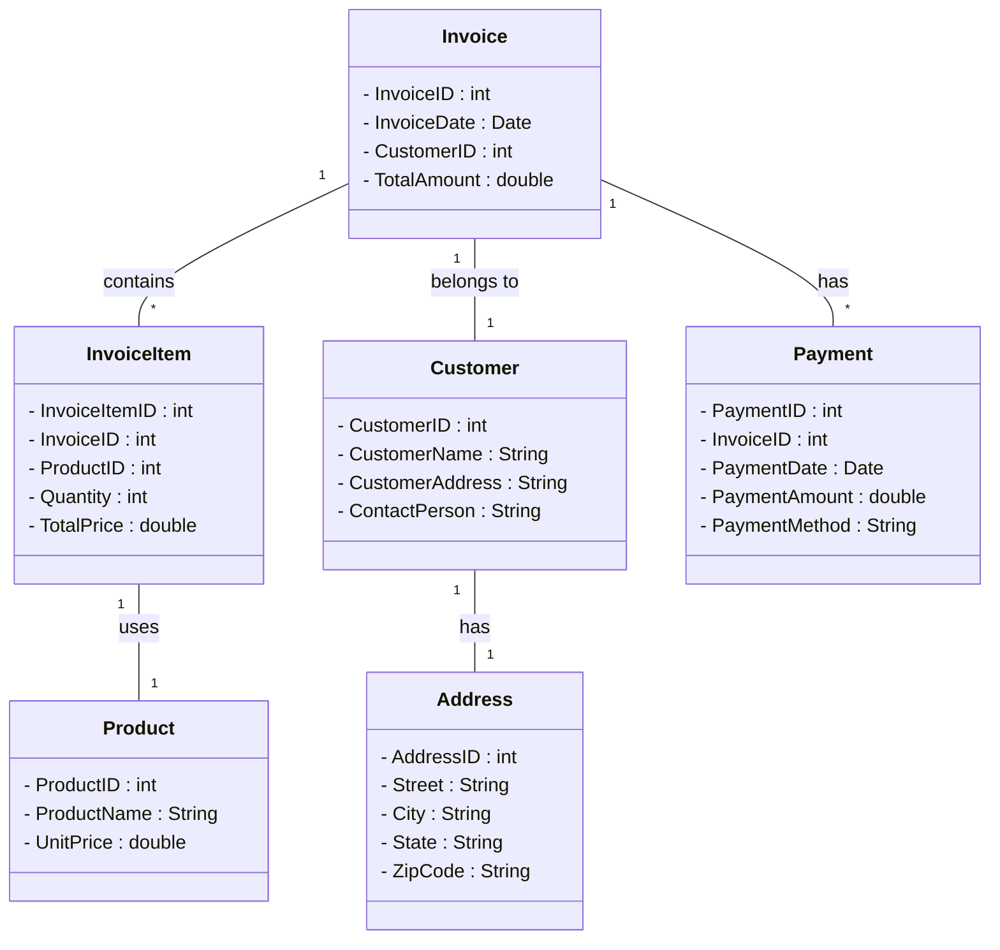

```mermaid
classDiagram
class Invoice {
    - InvoiceID : int
    - InvoiceDate : Date
- CustomerID : int
- TotalAmount : double
}
class Customer {
- CustomerID : int
- CustomerName : String
- CustomerAddress : String
- ContactPerson : String
}
class Product {
- ProductID : int
- ProductName : String
- UnitPrice : double
}
class InvoiceItem {
- InvoiceItemID : int
- InvoiceID : int
- ProductID : int
- Quantity : int
- TotalPrice : double
}
class Payment {
- PaymentID : int
- InvoiceID : int
- PaymentDate : Date
- PaymentAmount : double
- PaymentMethod : String
}
class Address {
- AddressID : int
- Street : String
- City : String
- State : String
- ZipCode : String
}

    Invoice "1" -- "*" InvoiceItem : contains
    Invoice "1" -- "1" Customer : belongs to
    InvoiceItem "1" -- "1" Product : uses
    Invoice "1" -- "*" Payment : has
    Customer "1" -- "1" Address : has
```